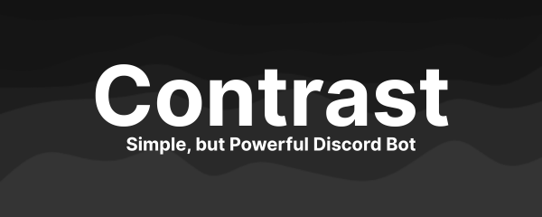

# Contrast Bot Website

<div align="center">

  

</div>

This repository contains the official website for Contrast Bot, a versatile Discord bot built with TypeScript and Discord.js.

## Website

The website is hosted at [contrast-bot.github.io](https://contrast-bot.github.io) using GitHub Pages.

## Technologies Used

This website is built with:

- HTML5
- CSS3 with Tailwind CSS
- JavaScript
- Geist Sans and Geist Mono fonts
- Font Awesome icons

## Repository Structure

- `README.md` - This annoying file
- `LICENSE` - License
- `index.html` - Main website page
- `styles.css` - Custom CSS styles
- `script.js` - JavaScript functionality
- `logo.png` - Bot logo image
- `banner.png` - Banner image for SEO

## Features

- Responsive design that works on mobile, tablet, and desktop
- Clean, minimalist interface inspired by Vercel's design language
- Interactive elements including animated counters
- Comprehensive information about the bot's features and commands

## Development

### Prerequisites

- Basic knowledge of HTML, CSS, and JavaScript
- A text editor or IDE
- Git

### Local Development

1. Clone the repository:
```
git clone [https://github.com/contrast-bot/contrast-bot.github.io.git](https://github.com/contrast-bot/contrast-bot.github.io.git)
```

1. Open the project in your preferred editor
2. Make your changes
3. Test locally by opening `index.html` in a browser (or using [Live Server](https://marketplace.visualstudio.com/items?itemName=ritwickdey.LiveServer))
4. Commit and push your changes:
```
git add .
git commit -m "Your descriptive commit message"
git push
```

## Contributing

Contributions are welcome! Feel free to submit a pull request or open an issue if you have suggestions for improvements.

1. Fork the repository
2. Create your feature branch (`git checkout -b feature/amazing-feature`)
3. Commit your changes (`git commit -m 'Add some amazing feature'`)
4. Push to the branch (`git push origin feature/amazing-feature`)
5. Open a Pull Request :)
   
## License

This project is licensed under the MIT License - see the [LICENSE](LICENSE) file for details.